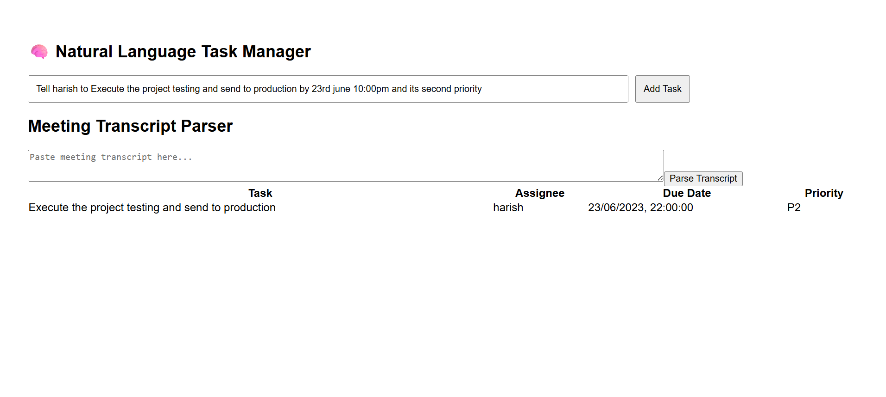

# 🧠 Natural Language Task Manager + AI Meeting Transcript Parser

This is an AI-powered web application that allows users to:

- ✅ Add tasks using **natural language**
- 📝 Paste an entire **meeting transcript** to extract structured tasks
- 📋 View, edit, and manage tasks in a beautiful UI

Built with:
- 💬 OpenAI GPT-4o for natural language understanding
- ⚙️ Node.js + Express (Backend)
- ⚛️ React + Vite (Frontend)
- 🎨 Tailwind CSS (Styling)

---

## 🔧 Setup Instructions

### 🖥 Backend Setup

1. Navigate to the backend folder:
   ```bash
   cd backend
   ```

2. Install dependencies:
   ```bash
   npm install
   ```

3. Create a `.env` file:
   ```
   OPENAI_API_KEY=your_openai_key_here
   ```

4. Start the server:
   ```bash
   node index.js
   ```

> Server runs at: `http://localhost:5000`

---

### 🌐 Frontend Setup

1. Navigate to the frontend folder:
   ```bash
   cd frontend
   ```

2. Install dependencies:
   ```bash
   npm install
   ```

3. Run the frontend:
   ```bash
   npm run dev
   ```

> App runs at: `http://localhost:5173`

---

## 🚀 Features

### 1. ✍️ Natural Language Task Parser

Users can input tasks in plain English.

**Example Input:**
```
Finish landing page Aman by 11pm 20th June P1
```

**Parsed Output:**
```json
{
  "task": "Finish landing page",
  "assignee": "Aman",
  "due": "2025-06-20T23:00:00",
  "priority": "P1"
}
```

**API Endpoint:**
```
POST /api/task/parse
```

---

### 2. 🧾 AI Meeting Transcript Parser

Paste a full meeting transcript and extract structured tasks.

**Example Transcript:**
```
Aman you take the landing page by 10pm tomorrow.
Rajeev you take care of client follow-up by Wednesday.
Shreya please review the marketing deck tonight.
```

**Parsed Output:**
```json
[
  {
    "task": "Take the landing page",
    "assignee": "Aman",
    "due": "2025-06-14T22:00:00",
    "priority": "P3"
  },
  {
    "task": "Take care of client follow-up",
    "assignee": "Rajeev",
    "due": "2025-06-18T23:59:59",
    "priority": "P3"
  },
  {
    "task": "Review the marketing deck",
    "assignee": "Shreya",
    "due": "2025-06-13T23:59:59",
    "priority": "P3"
  }
]
```

**API Endpoint:**
```
POST /api/meeting/parse
```

---

## 🔍 Difference Between the Two APIs

| Feature       | `/api/task/parse`                | `/api/meeting/parse`                 |
|---------------|----------------------------------|--------------------------------------|
| Input         | Single natural language sentence | Full meeting transcript              |
| Output        | One structured task object       | Array of structured task objects     |
| Use Case      | Manually typed tasks             | Automated transcript-to-tasks        |
| Complexity    | Simple parsing                   | Multiple task extraction             |

---

## 🖼 Screenshots

> 📌 Replace these filenames with your actual screenshots

### 🔹 Task from Natural Language Input


### 🔹 Parsed Tasks from Meeting Transcript


---

## 🛠 Tech Stack

- **OpenAI GPT-4o** — Natural language understanding
- **Node.js + Express** — API server
- **React + Vite** — Frontend framework
- **Tailwind CSS** — Styling and responsive layout

---

## 📁 Folder Structure

```
project-root/
├── backend/
│   ├── index.js
│   ├── routes/
│   └── .env
├── frontend/
│   ├── src/
│   └── vite.config.js
├── screenshots/
└── README.md
```
